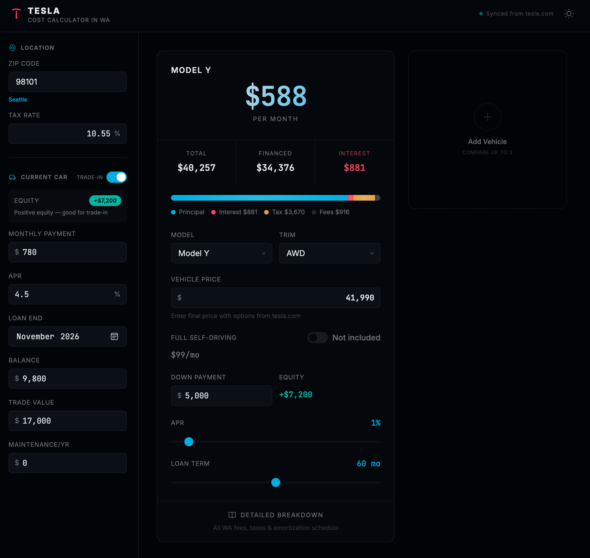
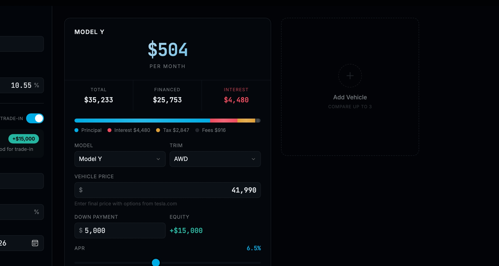

# Tesla Cost Calculator in WA

**The most accurate out-the-door cost estimator for buying a Tesla in Washington State.**

No hidden fees. No surprises. Every WA-specific tax and fee included — from EV surcharges to Sound Transit RTA tax to the new luxury tax.




---

## Key Features

| Feature | Description |
|---------|-------------|
| **All Tesla Models** | Model 3, Y, S, X, Cybertruck — every trim with live pricing |
| **WA State Fees** | Registration, title, EV fees, weight fees, RTA tax, luxury tax (SB 5801) |
| **Auto-Synced Prices** | Prices updated weekly from tesla.com via GitHub Actions |
| **Compare Up to 3** | Side-by-side comparison with "Best" badge |
| **Trade-In Analysis** | Equity calc, timing insights, 24-month projection |
| **Keep vs. Switch** | Compare your current car costs against a new Tesla |
| **Light / Dark Theme** | System preference detection with manual toggle |
| **Mobile Responsive** | Full functionality on all screen sizes |

## Auto-Synced Pricing

Prices are **automatically scraped from tesla.com every Monday** via GitHub Actions and committed to `prices.json`. The calculator loads this file at startup, so prices stay current without manual updates.

```
GitHub Actions (weekly) → scrape tesla.com → update prices.json → auto-commit
```

- **Schedule:** Every Monday 10:00 UTC
- **Manual trigger:** Available via `workflow_dispatch`
- **Fallback:** If scraping fails, existing prices are preserved

## WA State Fee Breakdown

| Fee | Amount | Source |
|-----|--------|--------|
| Destination & Doc | $1,390 | Included in Tesla price |
| Order Fee | $250 | Included in Tesla price |
| Filing Fee | $12.50 | WA DOL |
| Title Service | $18 | WA DOL (2026) |
| Registration Service | $11 | WA DOL (2026) |
| License Plates | $50 | WA DOL |
| Plate Reflection | $4 | WA DOL |
| Standard Tab | $30 | WA DOL |
| EV Registration | $150 | SB 5801 |
| EV Additional | $50 | SB 5801 |
| EV Electrification | $75 | WA DOL |
| Weight Fee | $38 - $92 | Model-dependent |
| RTA Tax | 1.1% of MSRP | Sound Transit areas only |
| Luxury Tax | 8% over $100K | Effective Jan 2026 |

> **Disclaimer:** Fee amounts are estimates and may not reflect the most current rates. Always verify with your local DOL office before making a purchase decision.

**Sources:**
- [WA DOL — Vehicle Registration Fees](https://www.dol.wa.gov/vehicles-and-boats/vehicle-title-and-registration/vehicle-registration-fees)
- [SB 5801 — EV Fee Restructuring (2025)](https://lawfilesext.leg.wa.gov/biennium/2025-26/Pdf/Bills/Session%20Laws/Senate/5801-S.SL.pdf)
- [Sound Transit — RTA Motor Vehicle Excise Tax](https://www.soundtransit.org/get-to-know-us/paying-for-system-expansion/motor-vehicle-excise-tax)
- [Tesla.com — Vehicle Pricing](https://www.tesla.com)
- [WA DOR — Sales Tax Rates](https://dor.wa.gov/taxes-rates/sales-use-tax-rates)

## Tech Stack

- **Single HTML file** — no build step, no dependencies
- Tailwind CSS v4 (browser CDN)
- oklch color system with CSS custom properties
- Vanilla JavaScript with innerHTML rendering + focus restoration
- Playwright (Python) for price scraping

## Project Structure

```
index.html              ← The calculator (open in any browser)
prices.json             ← Auto-updated Tesla pricing data
scripts/
  scrape_prices.py      ← Playwright scraper for tesla.com
.github/workflows/
  update-prices.yml     ← Weekly GitHub Actions workflow
```

## Usage

Open `index.html` in any modern browser. No server required.

For local development with auto-sync testing:
```bash
python -m http.server 8000
# Open http://localhost:8000
```

## License

MIT
